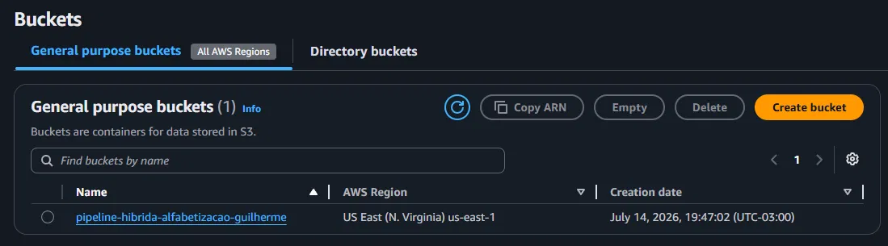
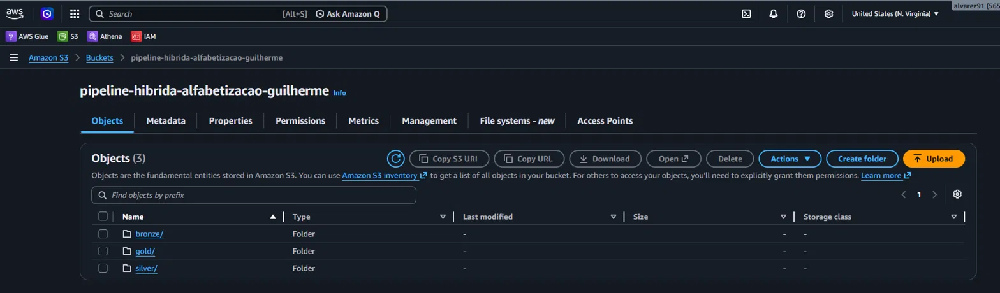

# Pipeline Híbrido para Análise da Alfabetização no Brasil

Tech Challenge – Fase 2 (Pós-Tech Data Analytics). Pipeline de dados híbrida
(batch + streaming) em arquitetura Medalhão (Bronze/Silver/Gold), integrando
dados do **Indicador Criança Alfabetizada**, com armazenamento em nuvem (AWS S3).

**Repositório:** https://github.com/guilhermealvdev/pipeline-hibrido

---

## 1. Contexto do problema

A alfabetização na infância é um dos pilares do desenvolvimento educacional,
social e econômico de um país. O **Compromisso Nacional Criança Alfabetizada**
mobiliza União, estados, Distrito Federal e municípios para garantir que todas
as crianças brasileiras estejam alfabetizadas até o final do 2º ano do ensino
fundamental.

Em 2023, o Inep realizou a **Pesquisa Alfabetiza Brasil**, definindo o ponto
de corte de **743 pontos** na escala de proficiência do Saeb como o patamar a
partir do qual uma criança é considerada alfabetizada. Desse parâmetro nasceu
o **Indicador Criança Alfabetizada (ICA)**, que mede o percentual de
estudantes que atingem esse nível, com meta nacional de 100% até 2030.

Entender os fatores que influenciam a alfabetização exige integrar diferentes
fontes de dados — metas nacionais, estaduais e municipais, e microdados por
aluno. É esse problema que este pipeline resolve: transformar fontes brutas e
heterogêneas em datasets analíticos confiáveis.

## 2. Fontes de dados

Todas as fontes vêm da plataforma [Base dos Dados](https://basedosdados.org/dataset/073a39d4-89cf-4068-b1e8-34ed0d9c0b72),
dataset `br_inep_avaliacao_alfabetizacao`, acessadas via biblioteca Python
`basedosdados` (que consulta o BigQuery):

| Entidade | Linhas extraídas | Descrição |
|---|---|---|
| `uf` | 145 | Indicadores agregados por UF |
| `municipio` | 23.995 | Indicadores agregados por município |
| `meta_alfabetizacao_brasil` | 3 | Meta nacional de alfabetização |
| `meta_alfabetizacao_uf` | 81 | Meta de alfabetização por UF |
| `meta_alfabetizacao_municipio` | 10.704 | Meta de alfabetização por município |
| `dados_alunos` | 3.867.999 | Microdados por aluno (granularidade mais fina) |

## 3. Arquitetura da solução

### 3.1 Fluxo de dados

1. **Extração batch** (`src/ingestion/batch/extracao_batch.ipynb`): baixa as
   6 entidades via BigQuery e grava em Parquet na camada Bronze, particionado
   por `ingestion_date`, sem nenhuma transformação de conteúdo.
2. **Extração streaming simulada** (`src/ingestion/streaming/simulador_eventos.py`):
   gera eventos sintéticos de atualização (nova medição, atualização de meta)
   um a um, com intervalo entre eles, reproduzindo o padrão de chegada de um
   producer Kafka/Kinesis real. Grava em JSON na Bronze.
3. **Transformação Silver** (`src/processing/silver/transformar_silver.py`):
   padroniza nomes de colunas, normaliza chaves (UF, município), remove
   duplicatas, reporta nulos, e integra `dados_alunos` com `municipio`.
4. **Validação de qualidade** (`src/quality/validacoes.py`): checa
   duplicidade (exata e por chave de negócio) e nulos em colunas críticas.
5. **Camada Gold** (`src/processing/gold/construir_gold.py`): gera três
   datasets analíticos — indicador por município, metas vs. resultados,
   evolução temporal.
6. **Publicação em nuvem**: as três camadas (Bronze/Silver/Gold) são
   publicadas em um bucket S3, preservando a estrutura de partições.

### 3.2 Por que Bronze/Silver/Gold em vez de um Data Warehouse único

- Preserva o dado bruto (Bronze) para auditoria e reprocessamento.
- Separa responsabilidades: limpeza (Silver) não se mistura com agregação
  analítica (Gold).
- Parquet + S3 é significativamente mais barato que um Data Warehouse
  gerenciado para o volume deste projeto (ver seção FinOps).

## 4. Decisões arquiteturais (trade-offs)

| Decisão | Escolha | Justificativa |
|---|---|---|
| Batch vs. Streaming | Híbrido | O indicador é publicado em ciclos anuais (batch é suficiente para o grosso do dado), mas o pipeline simula ingestão streaming para atualizações pontuais, provando suporte a ambos os padrões. |
| Kafka/Kinesis real vs. simulação | Simulação em Python | Um cluster Kafka ou stream Kinesis real não se justifica para o volume/SLA (atualização anual) deste dataset. A simulação reproduz o mesmo contrato de evento (JSON, um por vez, com timestamp), permitindo trocar por um producer real sem alterar Bronze/Silver. |
| Data Lake vs. Data Warehouse | Data Lake (S3 + Parquet) | Menor custo, maior flexibilidade de schema, compatível com consumo via pandas/Spark para ML e futuramente via Athena para SQL. |
| Processamento local vs. Spark | Pandas | Volume de dados (nível estado/município/aluno do Brasil, ~3.9M linhas no maior caso) cabe confortavelmente em memória; Spark adicionaria complexidade operacional sem ganho de performance neste caso. |
| Custo vs. Performance | Priorizando custo | Parquet particionado, sem clusters sempre ativos, processamento sob demanda via notebooks/scripts. |

## 5. Tecnologias utilizadas

| Ferramenta | Uso | Justificativa |
|---|---|---|
| **Python + pandas** | Transformação de dados | Simplicidade e produtividade para o volume dos dados |
| **basedosdados (lib)** | Extração das fontes | Acesso padronizado às tabelas públicas via BigQuery |
| **Jupyter Notebook** | Extração batch | Natureza exploratória — visualizar cada DataFrame ao extrair |
| **PyArrow / Parquet** | Formato de armazenamento | Colunar, compactado, com particionamento — reduz custo de storage e de scan |
| **AWS S3** | Data Lake | Armazenamento barato, durável, integra nativamente com Athena/Glue |
| **Git/GitHub** | Versionamento | Histórico de decisões, commits organizados por etapa |

## 6. Regras de qualidade de dados

Implementadas em `src/quality/validacoes.py`, aplicadas sobre a Silver:
- **Duplicidade**: exata (linha inteira) e por chave de negócio (`id_aluno` + `ano`) — resultado: 0 duplicatas.
- **Valores ausentes em colunas críticas**: `id_municipio`, `ano`, `id_aluno` — resultado: 0 nulos.
- **Integridade referencial**: verificada no momento do merge com `municipio` na Silver — 410 registros de `dados_alunos` (de 3.867.999) não encontraram município correspondente, provavelmente por códigos de município históricos/descontinuados na base do Inep. Achado documentado, não corrigido neste MVP.
- **Consistência entre tabelas**: chaves normalizadas (maiúsculas para UF, zero-padding de 7 dígitos para município) antes de qualquer merge, evitando perda silenciosa de linhas.

## 7. FinOps – Otimização de custos

- **Parquet + particionamento por `ingestion_date`**: reduz volume de dados
  escaneado em queries futuras (Athena cobra por TB escaneado), e permite
  reprocessar apenas partições específicas.
- **Sem infraestrutura sempre ativa**: os scripts rodam sob demanda (notebook
  batch, script streaming por job curto), sem cluster ocioso.
- **S3 em vez de banco gerenciado**: storage do S3 é ordens de magnitude mais
  barato que um banco relacional gerenciado para dados majoritariamente lidos.
- **Camada Gold pequena e agregada**: dashboards e modelos consomem datasets
  já agregados, evitando queries pesadas repetidas sobre o dado bruto (3.9M
  linhas na Bronze/Silver viram poucas milhares de linhas na Gold).
- **Free tier**: BigQuery (1TB de processamento/mês) e S3 (5GB) cobrem
  folgadamente o volume deste projeto.

## 8. Monitoramento (visão conceitual)

Não implementado neste MVP (opcional no desafio), mas o desenho proposto:
- **Falhas de ingestão**: cada etapa já imprime logs por entidade processada, permitindo identificar rapidamente onde uma falha ocorreu.
- **Volume processado**: cada script loga número de linhas salvas por camada — pronto para ser exportado a um CloudWatch Log Group.
- **Próximo passo natural**: automatizar a execução via GitHub Actions, com upload automático ao S3 a cada `git push`, substituindo a evidência manual (prints) por logs de execução auditáveis.

## 9. Aplicação em IA

A camada Gold foi desenhada para alimentar diretamente:
- **Modelos preditivos de alfabetização por município**: `indicador_por_municipio` pode treinar modelos de regressão para prever municípios em risco de não atingir a meta.
- **Análise de desigualdade educacional**: `evolucao_temporal` permite detectar estagnação ou regressão ao longo dos anos.
- **Políticas públicas baseadas em dados**: `metas_vs_resultados` permite priorizar investimento onde a distância entre meta pactuada e resultado real é maior.

## 10. Implementação em nuvem (AWS)

Bucket S3 criado na região `us-east-1` (N. Virginia):

**Nome do bucket:** `pipeline-hibrida-alfabetizacao-guilherme`



Estrutura das 3 camadas publicadas na raiz do bucket:



## 11. Como rodar

### Pré-requisitos
- Python 3.10+
- Projeto no Google Cloud com BigQuery API ativada (para a lib `basedosdados`)
- Conta AWS (para publicação em S3)

### Setup

```bash
git clone https://github.com/guilhermealvdev/pipeline-hibrido.git
cd pipeline-hibrido

python -m venv .venv
source .venv/bin/activate    # Windows: .venv\Scripts\activate

pip install -r requirements.txt

cp .env.example .env
# edite o .env com seu BD_BILLING_PROJECT_ID
```

### Execução

```bash
# 1. Extração batch (abrir e rodar todas as células)
#    src/ingestion/batch/extracao_batch.ipynb

# 2. Streaming simulado
python -m src.ingestion.streaming.simulador_eventos

# 3. Transformação Silver
python -m src.processing.silver.transformar_silver

# 4. Validação de qualidade
python -m src.quality.validacoes

# 5. Camada Gold
python -m src.processing.gold.construir_gold

# 6. Upload para S3 (feito manualmente via console AWS neste MVP)
```

## 12. Estrutura do repositório

```
pipeline-hibrido/
├── README.md
├── requirements.txt
├── .env.example
├── .gitignore
├── data/
│   ├── bronze/
│   ├── silver/
│   └── gold/
├── docs/
│   └── imagens/
│       ├── s3-bucket-raiz.png
│       └── s3-bucket-info.png
├── src/
│   ├── ingestion/
│   │   ├── batch/
│   │   │   └── extracao_batch.ipynb
│   │   └── streaming/
│   │       └── simulador_eventos.py
│   ├── processing/
│   │   ├── silver/
│   │   │   └── transformar_silver.py
│   │   └── gold/
│   │       └── construir_gold.py
│   ├── quality/
│   │   └── validacoes.py
│   └── utils/
│       └── paths.py
```